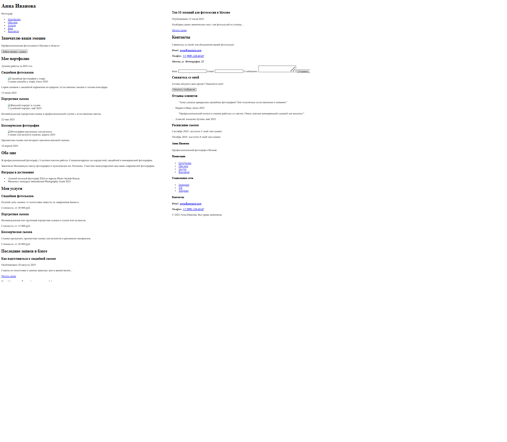

# html_website
Учебная работа 
# верстка веб-страницы

## Тема: Сайт-портфолио фотографа

### Макет:
В качестве макета использовался скриншот HTML-скелета страницы до добавления CSS.

### Готовый сайт:
Посмотреть результат можно по ссылке: [Мое портфолио на GitHub Pages](https://ariadna6662.github.io/html_website/)

### Код:
Исходный код находится в этом репозитории.
